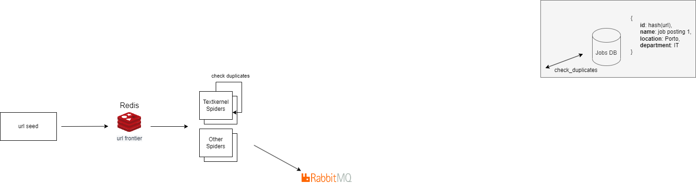
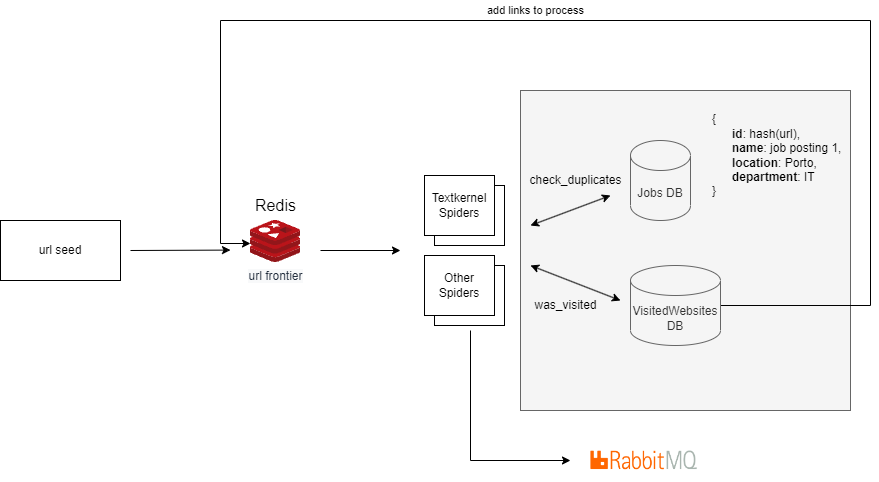

# jobs-crawler
This repo contains my solution to the textkernel challenge.

### Design Choices:



My system design consists in three main components:
 - url seed - Redis Publisher that handles which websites we want to scrape.
 - url frontier - Redis cache that stores websites to scrape and is accessed by several redis-spiders.
 - spiders - downloads html, parses their jobs, checks for duplicates and sends them to an external service via RabbitMQ

### Why use Redis and Scrapy-Redis? 
Scrapy-redis spiders can access redis as distributed workers. This means that for if there is more than one page of job postings, you can process each page in a separate spider.

### Why use RabbitMQ? 
RabbitMQ can handle assure that millions of job-postings are handled while also providing fault tolerance. The ability to establish retries and the usage of Dead-letter-queue can help to monitor and decrease the number of errors in the system.

### Setup Redis:
    ```docker
        docker run -d --name redis-stack-server -p 6379:6379 redis/redis-stack-server:latest
    ```

### Setup RabbitMQ with docker: 
    ```docker
        docker run -d -p 15672:15672 --hostname my-rabbit --name some-rabbit -e RABBITMQ_DEFAULT_USER=user -e RABBITMQ_DEFAULT_PASS=password rabbitmq:3-management
    ```

### Run project
1. Clone this project: `git clone https://github.com/jpribeiro7/jobs-crawler.git`
2. Create a Python Virtual Environment in the project: `python3 -m venv venv`
3. Activate the Python Virtual Environment: `source venv/bin/activate`
4. Install Scrapy using pip: `pip install -r requirements.txt`
6. Add the urls to redis: `python3 url_seed.py`
7. Running the scrapy project: `scrapy crawl jobspider` 

(Everytime you want to test you need to perform steps 6 and 7)


### Enable Duplicated Filtering
To enable duplicated filtering, we replace the step .7 from the section above with `scrapy crawl jobspider -s JOBDIR=crawls/jobspider`
From now on, crawls holds jobs previously added. To test that no message is being posted on the rabbitmq queue, simply access the rabbitmq console on localhost:15672. 


### Current limitations and bottlenecks:
1. The current architecture provides duplication handling for job postings via spider.state. This means that if we run several scrappers of the same type, it won't guarantee duplcation handling.
2. Links can currently be scrapped more than once. This means that different jobs of the same spider might process a link again.
3. We might run into anti-scraping techniques.
4. Only one spider was built.

To solve #1 and #2 we could build a separate shared cache (like Redis) as the following diagram shows:


To solve #3 we might need to timeout requests or implement proxies.


### Continuous Integration and Continuous Delivery
Github actions are used to build and test the project. Deployment wasn't done in time.

<!-- Pytest Coverage Comment:Begin -->
<!-- Pytest Coverage Comment:End -->

